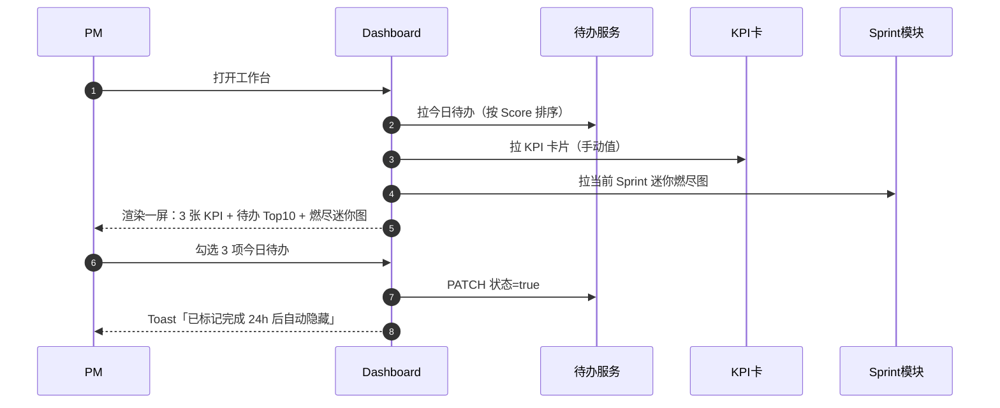
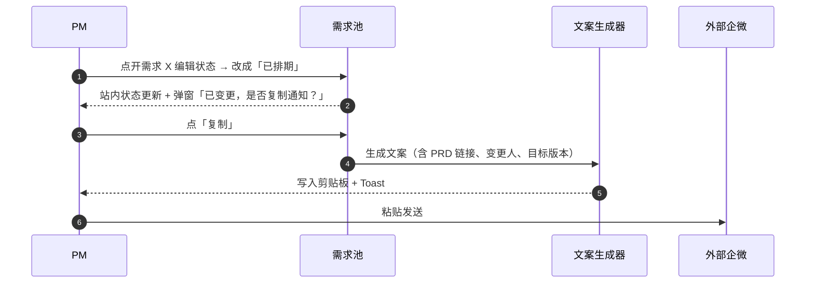
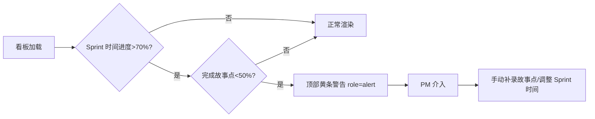
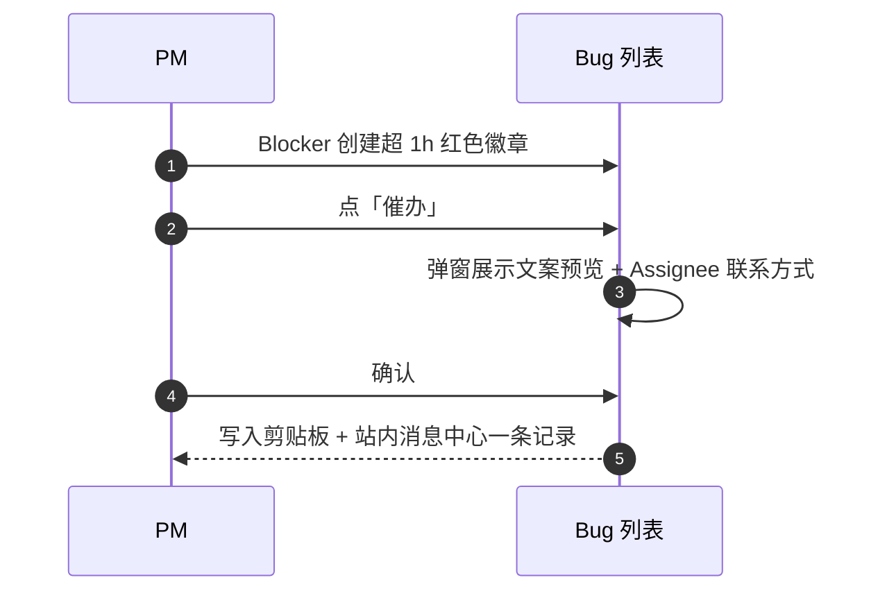
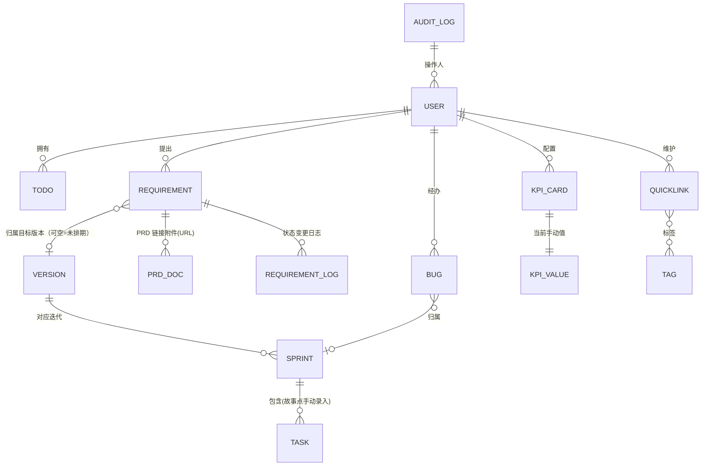
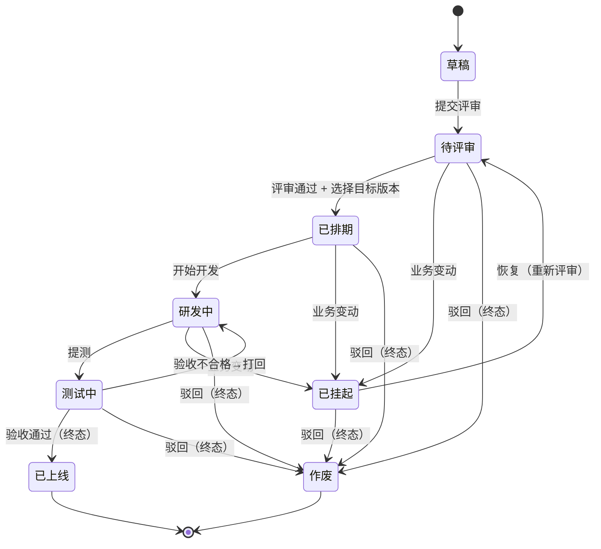

# 个人工作台 · 产品架构设计（PRD 衍生）

> 衍生自《个人工作台-PRD完善版 v2.1》，并按 **v2.2 约束修订**（数据上云 Supabase、账号体系、多 PC 互通）。本文档专注**产品架构**：定位、用户、IA、用户旅程、页面蓝图、数据模型、状态机。
> 技术栈、API、测试、部署请见配套《02-技术架构方案 v2.2》《03-测试用例 v2.2》。
> 最后更新：2026-08-07（v2.2 账号体系 / 上云修订）

---

## 0. 一句话定位

**一个"个人效率工作台"，把所有外部系统入口折叠成"链接 + 卡片"，把信息组织、流转、提醒全部结构化，让 PM 早上一屏看清"今天该干什么、谁卡我、风险在哪"。数据托管在 Supabase 云端 PostgreSQL（Free 起步），多 PC 登录同一账号即可实时互通；业务侧仍不实时对接 Jira/飞书/数仓，对外仅链接跳转 + 一键复制文案。**

- **不做**：实时对接外部业务系统（Jira/飞书/数仓同步）、企业 SSO、外部 Webhook 自动推送、AI 自动分类、独立 App、跨企业协作。
- **只做**：云端数据管理（supabase-js 直连）+ 链接跳转 + 防遗漏的预警提示 + 可分享/可导出的状态镜像 + 自建邮箱账号（Supabase Auth）。

---

## 1. 用户画像与核心场景

### 1.1 用户画像（单用户，资深 PM，背靠医药零售业务）

| 维度 | 描述 |
| --- | --- |
| 角色 | 资深 PM，业务侧 + 研发侧桥梁 |
| 工作内容 | 需求收集、版本规划、Sprint 跟进、Bug 跟进、向上汇报 |
| 信息环境 | Jira/飞书/数仓 6+ 个外部系统来回切；常被催进度；汇报要自己拼 Excel |
| 工作模式 | 早上打开→列今日清单；白天边切系统边登记状态；晚上做汇报 |
| 痛点（PRD 抽取） | 多标签页聚合成本高、P0 漏处理、Sprint 延期无预警、需求流转状态不可追溯 |
| 关键诉求 | "**打开一眼看清**" "**不漏 P0**" "**复制一段文案就能对外汇报**" |

### 1.2 四个核心使用场景（JTBD）

| 场景 | 用户目标 | 关键动作 | 成功标准 |
| --- | --- | --- | --- |
| 早 9:00「开机即开工」 | 看清今天最重要的 5 件事 | 打开 → 看 Dashboard → 勾今日待办 | ≤30 秒明确今日 3 件事 |
| 中午「状态更新」 | 在不打开外部系统的前提下完成跨系统状态流转 | 需求池改状态 → 复制文案 → 粘贴到企微 | 1 分钟内产出对外通知 |
| 下午「跟进延期」 | 干预 Sprint 风险、Bug 阻塞 | 看 Sprint 警告条 / Bug 列表 → 生成催办文案 | 在休会前完成催促 |
| 晚 6:00「日复盘」 | 留痕、补漏、备份 | 标记完成项、看燃尽图、导出日报 | 当日数据 100% 留痕 |

---

## 2. 信息架构（IA / 模块地图）

```
┌──────────────────────────────────────────────────────────┐
│                  个人工作台（PWA Web）                       │
├──────┬───────────────────────────────────────────────────┤
│      │  工作台首屏 / 早 9 看板                            │
│ 侧   │   ├─ 今日待办（按 Score 排序）                      │
│ 边   │   ├─ KPI 指标卡（3 张卡 + 外部跳转）                 │
│ 栏   │   ├─ 今日燃尽进度（迷你图）                          │
│      │   └─ 最近动过的需求（5 条）                          │
│ 导   ├──────┬────────────────────────────────────────────┤
│ 航   │ 需求 │  ▸ 需求池（表格/看板）                       │
│      │ 模块 │  ▸ 状态机：草稿→待评审→已排期→研发中→测试中    │
│      │      │     →已上线（终）/已挂起/作废（终）             │
│      │      │  ▸ 业务价值校验（含量化指标，强制阻断）          │
│      │      │  ▸ 状态变更 → 一键复制通知文案                  │
│      ├──────┼────────────────────────────────────────────┤
│      │ 路线 │  ▸ Roadmap（Kanban / 甘特）                  │
│      │ 图   │  ▸ 版本拖拽排期（含撤销 5–10s）                 │
│      ├──────┼────────────────────────────────────────────┤
│      │ 项目 │  ▸ Sprint 看板（4 列：待办/进行/验收/完成）    │
│      │ 跟进 │  ▸ 燃尽图（理想 vs 实际，故事点手动录入）        │
│      │      │  ▸ 延期预警条（时间进度 >70% 且完成 <50%）      │
│      ├──────┼────────────────────────────────────────────┤
│      │ Bug  │  ▸ Bug Tracker（Blocker/Critical/Major/Minor）│
│      │      │  ▸ 一键催办（生成文案 + 复制 Assignee）         │
│      ├──────┼────────────────────────────────────────────┤
│      │ 工具 │  ▸ 快捷链接（手动维护的入口库）                 │
│      │      │  ▸ 数据备份/导出 JSON / Excel                │
│      │      │  ▸ 操作日志（增删改状态留痕）                  │
└──────┴───────────────────────────────────────────────────┘
```

### 2.1 侧边栏导航（一级）

| 序号 | 入口 | 说明 |
| --- | --- | --- |
| 1 | **工作台** | Dashboard，今日待办 + KPI + 燃尽迷你图 |
| 2 | **需求池** | 需求 CRUD + 状态机流转 |
| 3 | **路线图** | Roadmap 拖拽排期 |
| 4 | **Sprint** | Sprint 看板 + 燃尽图 |
| 5 | **Bug** | Bug Tracker + 催办 |
| 6 | **快捷链接** | 自定义外部系统入口库 |
| 7 | **数据** | 备份 / 导出 / 操作日志 |

> ⚠️ 为符合 3.0/3.2 规范的"弹窗高度≤450px、宽度≤800px、移动端响应式"基线，所有列表页必须：表头加粗、左对齐文字/右对齐数字、操作列文字优先、15–30 条/页、可排序。

---

## 3. 核心用户旅程（端到端）

### 旅程 1：早 9:00 开机 → 开工



### 旅程 2：状态变更 → 复制通知



### 旅程 3：Sprint 临近逾期 → 干预



### 旅程 4：Bug Blocker → 催办



---

## 4. 数据模型（产品视角，与技术方案 Schema 对应）

> **v2.2 账号体系**：USER 实体现由 Supabase `auth.users` 承载，应用侧 `profiles` 表（1:1）扩展昵称 / 时区等。所有业务表以 `owner = auth.uid()` 做行级隔离（RLS），数据天然按用户隔离、支持多 PC 实时同步。详见《02-技术架构方案 v2.2》。



### 4.1 实体字段约定（产品语义）

| 实体 | 关键字段 | 业务约束 |
| --- | --- | --- |
| **TODO** | title(≤50必填)、source_url、priority(P0–P3)、deadline_at、done、owner、score（计算列） | Score=(4-PriorityLevel)×30 + max(0,72-HoursToDeadline)；完成后 24h 后视图移除（视图层按 done_at 过滤，云同步）；owner=auth.uid() 行级隔离 |
| **REQUIREMENT** | title(≤60)、source(枚举)、priority、status、value_desc(富文本含量化)、prd_url、target_version | 状态机：草稿/待评审/已排期/研发中/测试中/已上线/已挂起/作废；value_desc 必须含数字或"%/X 倍"等量化字样 |
| **VERSION** | name（如 v2.3）、release_date、color | Roadmap 列/甘特图轴 |
| **SPRINT** | name、start_at、end_at、total_points（手动）、version_id | 燃尽图依赖 |
| **TASK** | title、points（手动）、status、sprint_id | 用于 Sprint 燃尽图 |
| **BUG** | title、severity（Blocker/Critical/Major/Minor）、assignee、prd_url、created_at、fixed_at | Blocker 超 1h 红色徽章；催办不调外部 |
| **KPI_CARD** | label、value（手动）、unit、external_url、sort | 点击卡片 target=_blank 跳转 |
| **QUICKLINK** | label、url、icon、tag、sort | 用户自维护入口库 |
| **AUDIT_LOG** | actor、entity、entity_id、action、before/after、at | 增/改状态/删留痕 |

---

## 5. 业务规则与状态机

### 5.1 需求状态机（与 PRD 一致，落地版）



### 5.2 紧迫度算法（待办 Score）

```
Score = (4 - PriorityLevel) × 30 + max(0, 72 - HoursToDeadline)

PriorityLevel: P0=0, P1=1, P2=2, P3=3
HoursToDeadline: 距 deadline 的小时数（可为负，已逾期不加分不减分）
结果：列表按 Score 降序置顶；负数视为逾期但仍展示
```

### 5.3 预警规则

| 触发条件 | 行为 |
| --- | --- |
| Sprint 时间进度 >70% 且 完成故事点 <50% | 看板顶部固定黄底警告条 `role="alert"` |
| Blocker Bug 创建 >1h 仍未指派/未修 | 列表卡片左上红色徽章 + 详情页黄条 |
| KPI 卡指标值超过 7 天未维护 | 卡片右上"数据过期"小角标 |
| P0 待办距离 deadline <2h | Dashboard 红点提醒（仅提示，不自动发送） |

### 5.4 校验规则（落点）

| 校验 | 落点 |
| --- | --- |
| 必填校验 | 字段名 + 红 `*`；失焦即时红框；提交再校验 |
| URL 格式 | 仅正则校验 `^https?://`，不调外部 |
| 业务价值量化 | 正则匹配 `/(\d|%|X 倍|提升\d|降低\d)/`，否则阻断 |
| 标题去重 | 同一"需求"集合内标题 trim 后不可重复 |
| 截止时间必晚于当前 | `deadline_at > now()`，否则警告（不阻断，允许补录历史） |
| 操作脏检查 | 编辑/新增表单 leave-before-save 弹确认 |

---

## 6. 页面蓝图与组件清单

### 6.1 页面清单

| # | 路由 | 页面 | 主要内容 | 关键组件 |
| --- | --- | --- | --- | --- |
| 1 | `/` | Dashboard | KPI×3 / 今日待办 / 燃尽迷你图 / 最近需求 | GradientCard、TodoItem、BurnMini、KPICard |
| 2 | `/requirements` | 需求池列表 | 表格 + 状态过滤 + 查询 + 批量 | DataTable、StatusBadge、FilterBar |
| 3 | `/requirements/:id` | 需求详情 | 详情 + 状态机 + 日志 + 操作 | StateMachineStepper、ChangeLogList |
| 4 | `/roadmap` | 路线图 | Kanban / 甘特 Tab | KanbanBoard、GanttChart |
| 5 | `/sprints` | Sprint 看板 | 4 列 + 燃尽图 + 警告条 | SprintColumn、BurndownChart、AlertBar |
| 6 | `/bugs` | Bug 列表 | 表格 + 严重度色块 + 催办按钮 | BugTable、SeverityBadge、UrgeModal |
| 7 | `/links` | 快捷链接库 | 卡片网格 | LinkCard |
| 8 | `/data` | 数据 | 备份导出 + 操作日志 | DataPanel、ExportButton、LogTable |
| 9 | `*` | 404 | 迷失页 | EmptyState |

### 6.2 关键组件一览

| 组件 | 职责 | 复用页 |
| --- | --- | --- |
| `<AppShell>` | 全局壳：侧边栏 + 顶部 + 主内容 | 全部 |
| `<GradientCard>` | 渐变背景数据卡（参考截图风格） | Dashboard / 详情 |
| `<TodoItem>` | 待办行，含勾选、来源链接、Deadline | Dashboard |
| `<KPICard>` | KPI 卡，点击新窗跳转外部看板 | Dashboard |
| `<BurnMini>` | 迷你燃尽图（折线） | Dashboard |
| `<StatusBadge>` | 状态色块（按状态返回颜色） | 需求池 / Bug |
| `<StateMachineStepper>` | 状态机步骤条 | 需求详情 |
| `<KanbanBoard>` | 拖拽 Kanban（版本为列） | Roadmap |
| `<DataTable>` | 通用表格（排序/筛选/分页/批量） | 需求池 / Bug / 日志 |
| `<UrgeModal>` | 一键催办弹窗（生成文案预览） | Bug |
| `<Toast>` | 全局提示，4 态色 | 全部 |
| `<ConfirmDialog>` | 删除/批量确认 | 全部 |
| `<EmptyState>` | 空/404/错误 6 态 | 全部 |

---

## 7. 视觉与交互规范落地（参考截图风格）

> 截图来源：知识管理 "阅读管理"，取其**深色科技风**与**卡片信息密度**，不复制业务形态。

### 7.1 设计令牌（Design Tokens）

| 令牌 | 值 | 用途 |
| --- | --- | --- |
| `--bg-base` | `#0a0a0f` | 全局底色 |
| `--bg-surface` | `#14141b` | 卡片底 |
| `--bg-elevated` | `#1c1c26` | 浮层/弹窗 |
| `--border` | `rgba(255,255,255,0.08)` | 卡片描边 |
| `--text-primary` | `#f5f5f7` | 主文 |
| `--text-secondary` | `#a0a0aa` | 辅助文 |
| `--text-muted` | `#6b6b75` | 占位/说明 |
| `--accent-primary` | `#00d97e` | 主强调（绿） |
| `--accent-warning` | `#f5a623` | 警告（橙） |
| `--accent-danger` | `#ff4757` | 危险（红） |
| `--accent-info` | `#3b82f6` | 信息（蓝） |
| `--grad-warm` | `linear-gradient(135deg,#f5a623 0%,#ff8a5b 50%,#ff5e7e 100%)` | 暖色 KPI 卡（参考截图橙→粉） |
| `--grad-cool` | `linear-gradient(135deg,#3b82f6 0%,#8b5cf6 50%,#00d97e 100%)` | 冷色卡 |
| `--grad-violet` | `linear-gradient(135deg,#8b5cf6 0%,#ec4899 100%)` | 紫粉卡 |
| 圆角 | 12px（卡）/ 8px（按钮）/ 16px（弹窗） | |
| 间距 | 8 / 12 / 16 / 24 / 32 | 4 阶制 |
| 字号 | 12 / 13 / 14 / 16 / 20 / 28 / 40 | |
| 字体 | `"Inter","PingFang SC","Microsoft YaHei",sans-serif` | |
| 阴影 | `0 4px 24px rgba(0,0,0,0.4)` | 卡片 |
| 毛玻璃 | `backdrop-filter: blur(12px)` | 顶部栏/侧边栏 |

### 7.2 截图风格映射 → 本工作台

| 截图中元素 | 本工作台对应 |
| --- | --- |
| 左侧深灰侧边栏 | `<AppShell.Sidebar>`，图标 + 文字 1 级导航 |
| 顶部搜索 + 操作区 | `<AppShell.Topbar>`：搜索 + 通知 + 用户 |
| 渐变色 KPI 大卡（今日新增 12 / 未读 28...） | Dashboard `GradientCard`：3 张卡：今日待办数/P0 数/Sprint 进度 |
| 右侧"智能详情"侧栏 | 详情页右侧抽屉（需求详情/Bug 详情） |
| 阅读队列列表 + 状态 Tag | 待办列表 + 状态 Badge |
| 中央 3D 卡片 + 87% 进度 | Dashboard 中部"今日 Sprint 进度"卡片 |
| 底部时间轴 | `/sprints` 燃尽图与日线时间轴 |
| 暗色背景 + 渐变玻璃感 | 全站 Dark Mode |

### 7.3 交互细节

- **首屏** ≤1.5s：使用骨架屏（Skeleton），本地数据无外部等待
- **列表 15–30 条/页**，>1000 自动启用虚拟滚动
- **完成待办**：勾选 → 行加删除线 → Toast"24h 后移除"
- **拖拽排期**：实时扣减未排期池 + 5–10s「撤销」Toast
- **键盘**：Enter 提交、Esc 关弹窗、Tab 焦点循环、Ctrl+S 保存
- **焦点**：可见 outline + `aria-label` 关键控件
- **光标**：可点击 pointer / 禁用 not-allowed / 拖拽 move

### 7.4 6 态空错页

| 状态 | 图标 | 文案 | CTA |
| --- | --- | --- | --- |
| 暂无数据 | 空盒子 | "暂无数据" | "去新建" |
| 未查到结果 | 放大镜 | "未查找到相关记录" | "修改查询条件" |
| 未登录/无权限 | 锁 | "请先登录或联系管理员" | "去登录" |
| 404 | 迷失 | "页面不存在或已被删除" | "返回首页" |
| 500 | 齿轮 | "服务器异常，请稍后重试" | "重新加载" |
| 网络断开 | WiFi 断 | "网络连接失败，请检查网络" | "重新连接" |

---

## 8. 内容/文案规范

| 场景 | 文案 | 说明 |
| --- | --- | --- |
| 状态变更复制文案模板 | `[需求名] 已从「待评审」→「已排期」，目标版本 vX.Y。\n负责人：@XXX\nPRD：{url}\n详情：{本工作台链接}` | 用户复制后直接粘贴 |
| 一键催办文案 | `[{severity}] {title} 已创建 {duration} 仍未修复，请尽快介入。\n经办：@{assignee}（{contact}）\n详情：{url}` | 含联系方式占位 |
| 导出日报标题 | `工作台日报-{YYYY-MM-DD}.xlsx` | |
| 操作日志条目 | `{时间} · {人} · {动作} · {对象}` | 保留 30 天 |

---

## 9. 不做清单（Out of Scope，防守纪律）

| 不做项 | 原因 |
| --- | --- |
| Jira/飞书/钉钉 实时同步（业务） | v2.2 维持不做；数据上云 Supabase 属存储基础设施，非业务对接 |
| 神策/数仓 自动 KPI 拉取 | 改"手动 + 跳转" |
| 企微/钉钉 Webhook 自动推送 | 改"复制文案"（用户手动粘贴，不自动发） |
| 企业 SSO | 维持不做；改用 Supabase Auth 自建邮箱账号（非企业 IdP） |
| 自研后端 / 自管数据库 | v2.2 不做；直接 supabase-js 直连托管 PG，降运维 |
| AI 自动分类/打标 | 先做人工 Tag |
| 移动 App | 仅 Web 响应式 |
| 跨企业协作 | 单人工作台（多 PC = 同一用户） |

---

## 10. 验收 Checklist（产品向）

- [ ] 一句话定位与 PRD v2.1 范围一致，且已反映 v2.2 上云 / 账号体系约束修订
- [ ] 4 个核心旅程有可走通的端到端流程
- [ ] 所有状态机转移均有合法校验（前端 + 后端）
- [ ] 6 态空错页与 Toast 规范齐备
- [ ] 视觉令牌、字号、间距、颜色统一（设计系统先于页面）
- [ ] 列表页规范（排序/分页/批量/导出）落地
- [ ] 复制通知文案模板可直接用于企微
- [ ] Out of Scope 边界在 UI 中有明确禁用/隐藏

---

> 接续阅读：**[技术架构方案.md](./技术架构方案.md)** · **[测试用例.md](./测试用例.md)**
