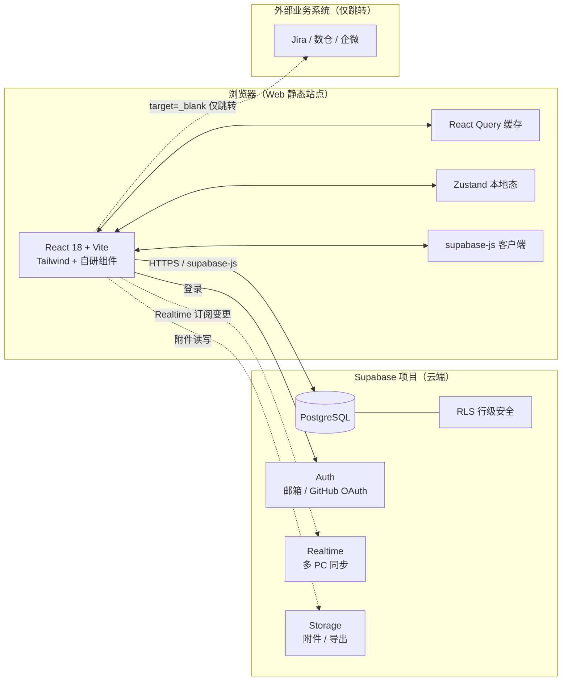

# 个人工作台 · 技术架构方案

> 与《01-产品架构设计》配套。本文专注**技术栈选型、架构图、数据 Schema、访问层、安全、部署、运维**，不动代码先对齐方案。
> 最后更新：2026-08-07（**v2.2 修订：数据上云 + 多 PC 互通**）

---

## 修订说明（v2.1 本地 → v2.2 云端 Supabase）

2026-08-07 11:00 用户新增需求：**最终要对接外部数据库（如 Supabase），联网、多 PC 数据互通**。
经澄清（AskUserQuestion）确认三项边界：

| 项 | 决定 |
| --- | --- |
| 数据库集成方式 | **Supabase BaaS 直连**（前端经 `supabase-js` 直连托管 PostgreSQL，内置 Auth / Realtime / Storage，**免自研后端**） |
| 账号认证 | **Supabase Auth 自建账号**（邮箱密码 / GitHub OAuth），属应用自有账号，**非企业 SSO** |
| 业务系统对接 | **仅存储上云，业务仍不对接** Jira / 飞书 / 数仓等，对外仍仅链接跳转 |

→ 由此对原 PRD v2.1 的以下约束做修订（详见《01》待补 v2.2 修订说明）：
- 「数据不出本机 / 本地存储」→ 改为「数据存于**用户自有 Supabase 项目**（云端、用户可控）」
- 「不接 SSO」→ 维持「不接企业 SSO」，但引入 Supabase Auth 自建账号
- 「不接外部系统实时集成」→ 维持「不实时对接业务系统」，Supabase 属基础设施、**不算业务对接**

---

## 0. 选型一览（结论先行）

| 层 | 选择 | 版本 | 决策理由 |
| --- | --- | --- | --- |
| 前端框架 | React | 18.3 | 生态最熟、组件化契合多页面 |
| 构建 | Vite | 5.x | 启动快、HMR 顺、首屏快、产物可静态托管 |
| 语言 | TypeScript | 5.x | 类型安全 |
| 样式 | Tailwind CSS | 3.4 | 暗色科技风强自定义 |
| 组件库 | **不引入 AntD**，自研 + Radix UI Primitives | Radix 1.x | 视觉契合参考图 |
| 状态/服务端缓存 | Zustand + React Query | Zustand 4 / RQ 5 | 本地态 + 服务端态缓存 |
| 路由 | React Router | 6.x | SPA 路由 |
| 拖拽 | dnd-kit | 6.x | Kanban + Roadmap |
| 图表 | Recharts | 2.x | 燃尽/甘特 |
| 表单校验 | React Hook Form + Zod | RHF 7 / Zod 3 | 一份 Zod 驱动前端表单 |
| 图标 | lucide-react | latest | |
| **BaaS 平台** | **Supabase** | 2.x（Free 起步） | 托管 PostgreSQL + Auth + Realtime + Storage 一体化 |
| **前端数据客户端** | **supabase-js** | 2.x | 直连 PG、订阅 Realtime、走 RLS |
| **可选边缘函数** | Supabase Edge Functions（Deno） | — | 仅做"通知文案生成"等不便放前端的逻辑 |
| 测试 | Vitest + Testing Library + Playwright | latest | 与 Vite 一致；**去 Supertest（无自研 REST）** |
| 包管理 | npm | 10.x | |
| 前端托管 | **GitHub Pages / Vercel / Cloudflare Pages** | — | 静态站点免费托管（替代原 3003 端口） |

### 数据库最终选择：Supabase 托管 PostgreSQL（Free 起步）

| 备选 | 评估 | 结论 |
| --- | --- | --- |
| **Supabase（推荐）** | 托管 PG + Auth + Realtime + Storage 一体；Free：500MB 库、月 2 亿次请求上限、2 个项目；RLS 行级安全；多 PC 实时同步开箱即用 | ✅ **采用** |
| Neon | Serverless PG，512MB 免费，分支式；但需自接 Auth / Realtime | 备选 |
| Turso | 边缘 LibSQL（SQLite 兼容），免费额度；并非 PG，SQL 方言略异 | 备选 |
| Cloudflare D1 | 边缘 SQLite，免费；需配 Workers，无现成 Auth/Realtime | 备选 |
| 自管 PG + 自建后端 | 完全自控，但运维成本高，违背"零运维"初衷 | ❌ |
| 本地 SQLite | 原方案，不满足联网/多 PC 互通 | ❌（已弃） |

> Supabase 是独立 SaaS（非 GitHub 家）。经典免费组合：**前端白嫖 GitHub Pages + 数据白嫖 Supabase**，零服务器成本。
> GitHub Pages 本身**不是数据库**（仅静态托管），不能存动态数据。

---

## 1. 总体架构图（BaaS 模式）



**关键点**：
- **无自研后端**；前端直连 Supabase，RLS 保证"每用户只能读写自己的数据"
- 多 PC 通过 Realtime 频道订阅变更，**秒级互相同步**（一处改，别处实时刷新）
- 外部业务系统仍仅 `target="_blank" rel="noopener noreferrer"` 跳转，不拉数据
- 敏感字段（业务价值说明）在 PG 端加密存储（见 §5）

---

## 2. 目录结构（纯前端 + Supabase）

```
personal-workbench/
├─ supabase/                    # Supabase 项目（CLI 管理，SQL 版本化）
│  ├─ migrations/
│  │  ├─ 0001_init.sql          # 8 张表 + 外键 + owner
│  │  ├─ 0002_rls.sql           # RLS 策略 + 触发器
│  │  └─ 0003_crypto.sql        # 敏感字段加密（pgcrypto / Vault）
│  ├─ seed.sql                  # 演示数据
│  ├─ functions/                # Edge Functions（可选）
│  │  └─ share-text/index.ts    # 状态变更通知文案生成
│  └─ config.toml
├─ frontend/                    # React + Vite（静态站点）
│  ├─ src/
│  │  ├─ lib/supabase.ts        # 客户端初始化（URL + anon key）
│  │  ├─ hooks/                 # useTodos / useRequirements / ...（RQ + supabase）
│  │  ├─ api/transition.ts      # 状态机合法性校验（前端 / RPC）
│  │  ├─ pages/                 # Dashboard / Requirements / Roadmap / Sprints / Bugs / Links / Data
│  │  ├─ components/            # 同前（shell/cards/charts/data/feedback/kanban/gantt）
│  │  ├─ store/                 # Zustand
│  │  ├─ styles/                # tokens.css / globals.css（深色科技风）
│  │  └─ types/
│  ├─ tests/e2e/                # Playwright
│  ├─ vite.config.ts
│  └─ package.json
├─ shared/schemas/              # Zod（前端表单校验 + 类型推导）
├─ docs/ 01-产品架构设计.md · 02-技术架构方案.md（本文件）· 03-测试用例.md
├─ .github/workflows/           # CI：构建 + 部署 GitHub Pages
├─ .env.example                 # VITE_SUPABASE_URL / VITE_SUPABASE_ANON_KEY
└─ README.md
```

> 已删除原 `backend/`（Express + SQLite）。数据访问全部走 `supabase-js`。

---

## 3. 数据库 Schema（PostgreSQL / Supabase）

> 字符集 `utf-8`；时间 `timestamptz`（ISO8601 + 时区）；布尔 `boolean`；主键 `uuid`（不暴露自增序号，防枚举遍历）。
> **每张业务表必含 `owner uuid`**，引用 `auth.users(id)`，RLS 据此隔离。

### 3.1 初始化（0001_init.sql 节选）

```sql
create extension if not exists "pgcrypto";

create table if not exists todo (
  id           uuid primary key default gen_random_uuid(),
  owner        uuid not null references auth.users(id) on delete cascade,
  title        text not null check (char_length(title) <= 50),
  source_url   text,
  priority     text not null default 'P2'
                check (priority in ('P0','P1','P2','P3')),
  deadline_at  timestamptz,
  done         boolean not null default false,
  done_at      timestamptz,
  order_index  int not null default 0,
  created_at   timestamptz not null default now(),
  updated_at   timestamptz not null default now()
);
create index idx_todo_owner  on todo(owner);
create index idx_todo_done   on todo(done);

create table if not exists requirement (
  id             uuid primary key default gen_random_uuid(),
  owner          uuid not null references auth.users(id) on delete cascade,
  title          text not null check (char_length(title) <= 60),
  source         text not null default '手动',
  priority       text not null default 'P2' check (priority in ('P0','P1','P2','P3')),
  status         text not null default '草稿'
                  check (status in ('草稿','待评审','已排期','研发中','测试中','已上线','已挂起','作废')),
  value_desc_enc text,                       -- 加密存储业务价值（见 §5）
  prd_url        text,
  target_version uuid,                       -- 外键 version.id，可空=未排期
  created_at     timestamptz not null default now(),
  updated_at     timestamptz not null default now()
);
create index idx_requirement_owner    on requirement(owner);
create index idx_requirement_status   on requirement(status);
create index idx_requirement_version  on requirement(target_version);

-- version / sprint / task / bug / kpi_card / quicklink / audit_log 均含 owner + 同构索引
-- （bug.severity ∈ Blocker/Critical/Major/Minor；task.status ∈ 待办/进行中/验收/完成；
--   bug.status ∈ 待修/修复中/已修/不修；kpi_card/quicklink 结构从略，参见原 SQLite 版字段）
```

### 3.2 updated_at 触发器（PG 函数，替代 SQLite PRAGMA/触发器）

```sql
create or replace function set_updated_at() returns trigger as $$
begin new.updated_at = now(); return new; end; $$ language plpgsql;

create trigger trg_todo_upd  before update on todo        for each row execute function set_updated_at();
create trigger trg_req_upd   before update on requirement for each row execute function set_updated_at();
create trigger trg_spr_upd   before update on sprint      for each row execute function set_updated_at();
create trigger trg_kpi_upd   before update on kpi_card    for each row execute function set_updated_at();
```

### 3.3 行级安全（0002_rls.sql，多用户隔离核心）

```sql
alter table todo enable row level security;
create policy "owner_rw_todo" on todo
  for all using (owner = auth.uid()) with check (owner = auth.uid());
-- requirement / version / sprint / task / bug / kpi_card / quicklink / audit_log 同理
```

> 即使前端持有公开的 `anon key`，没有对应用户的 JWT 也只能读写**自己 owner 的数据**，RLS 在数据库层兜底。

### 3.4 敏感字段加密（0003_crypto.sql）

```sql
-- 应用层 AES-GCM 加密后存 value_desc_enc；或 PG 端用 pgcrypto：
-- insert into requirement(value_desc_enc) values (pgp_sym_encrypt(:plain, current_setting('app.enc_key')));
-- 密钥由 Supabase Vault 管理，不暴露前端明文
```

---

## 4. 数据访问层（不再是 REST，是 supabase-js）

> 无自研 `/api`，前端经 `supabase-js` 直接操作表；RLS 自动过滤 `owner`。

| 资源 | supabase 调用 | 说明 |
| --- | --- | --- |
| 今日 TODO | `from('todo').select().order('score',{ascending:false})` | Score 由前端/视图计算列 |
| TODO CRUD | `insert/update/delete` | RLS 校验 owner |
| 需求列表 | `from('requirement').select()` | |
| 状态变更 | `rpc('transition', {id, to, note})` 或 Edge Function | **后端校验状态机合法性**，返回 shareText |
| 文案生成 | Edge Function `share-text` | 拼「待评审→已排期」+ 版本 + PRD 链接，不暴露密钥 |
| 版本/排期 | `from('version')` / `update({target_version})` | |
| Sprint / 燃尽 | `from('task')` 聚合 或 PG 视图 `v_burndown` | 返回 ideal/actual |
| Bug / 催办 | `from('bug')` / Edge Function `urge-text` | 仅生成文案，不调外部 |
| KPI / 链接 | `from('kpi_card')` / `from('quicklink')` | |
| 审计 | DB 触发器写 `audit_log`（前端只读自己 owner 的） | |
| 导出 | 前端拉全量 → 生成 CSV/JSON（或存 Storage 供下载） | |
| 实时同步 | `supabase.channel('todo').on('postgres_changes', ...)` | 多 PC 秒级刷新 |

**错误映射**：PostgREST 错误 `{ code, message, details }` → 前端统一提示；状态机非法 → `409`；量化缺失/URL 非法/标题重复 → `422`（在 transition RPC / 前端 Zod 双层校验）。

---

## 5. 安全与合规（云端版）

| 项 | 措施 |
| --- | --- |
| 通信 | HTTPS（Supabase 托管 TLS） |
| 认证 | Supabase Auth：邮箱+密码 / GitHub OAuth；**非企业 SSO** |
| 授权 | RLS 行级安全，`owner = auth.uid()`；`anon key` 公开但受 RLS 限制；`service_role` key 绝不进前端 |
| XSS | React 转义 + 富文本 `react-markdown` + DOMPurify |
| 加密 | 敏感字段 `value_desc` 用 Supabase Vault / pgcrypto AES；密钥不落前端明文 |
| 审计 | DB 触发器写 `audit_log`，保留 30 天，前端按 owner 只读 |
| 失链 | 外部 URL 仅展示文本，点击 `target=_blank rel=noopener noreferrer` |
| 备份 | Supabase 自动每日备份（Free 保留短期）+ 手动导出 JSON 兜底 |
| 合规 | 数据存**用户自有 Supabase 项目**，可控；不对接业务系统；仍符合"不实时对接 Jira/飞书" |

---

## 6. 性能与 NFR

| 指标 | 目标 | 方案 |
| --- | --- | --- |
| 首屏 ≤1.5s | 静态站点 + CDN | Vite 构建 + GitHub Pages/Vercel Edge |
| 列表 >1000 | 不卡 | TanStack Virtual 虚拟滚动 |
| 多 PC 同步延迟 | <1s | Supabase Realtime |
| API 响应 | 50–150ms | Supabase 边缘节点 + RQ 缓存 |
| 离线可用 | 基本可读 | localStorage/IndexedDB 缓存 + 重连后增量同步 |
| 包体积 | ≤400KB gzip | Tailwind purge + 按需图标 |
| A11y | AA | 焦点可见、aria-label、键盘可达 |

---

## 7. 部署架构（静态前端 + 云数据库，零服务器）

### 7.1 前端托管（三选一，均免费）

| 平台 | 特点 | 适用 |
| --- | --- | --- |
| **GitHub Pages** | 仓库 `gh-pages` 分支 / Actions 部署；纯静态 | 您已有 GitHub，零成本 |
| **Vercel** | Git 集成、SPA 路由友好、预览环境 | 体验最佳 |
| **Cloudflare Pages** | 全球 CDN、免费 | 国内访问可能更稳 |

### 7.2 数据库

- Supabase 云项目（Free 起步）
- SQL 迁移经 `supabase db push` 推到云端；RLS 随迁移生效

### 7.3 配置（不提交密钥）

```env
# .env（前端构建期注入，仅 anon key，安全）
VITE_SUPABASE_URL=https://xxxx.supabase.co
VITE_SUPABASE_ANON_KEY=eyJ...（public anon key）
# service_role key 仅用于本地迁移 CLI，绝不进前端/仓库
```

### 7.4 备份 / 恢复

- Supabase 自动备份 + 手动「导出 JSON」（`from(table).select('*')` 全量）
- 恢复：重新 `supabase db push` + 导入 JSON

---

## 8. 监控与可观测性

| 维度 | 实现 |
| --- | --- |
| 前端错误 | Sentry（可选）/ console + 反馈按钮 |
| 后端用量 | Supabase 仪表盘：API 次数、错误日志、Realtime 连接数 |
| 性能 | 前端 Performance API；Supabase 日志 |
| 无自研后端 | 故无 pino / AppError / /api/health（改为 Supabase 状态页） |

---

## 9. 与参考 UI 的对应实现（同 v2.1，路径改为 frontend/）

| 截图元素 | 本系统实现位置 |
| --- | --- |
| 左侧深色侧边栏 | `AppShell.Sidebar` |
| 顶部搜索 + 操作区 | `AppShell.Topbar`（含用户头像 / 登出） |
| 渐变色 KPI 大卡 | `GradientCard` + Dashboard 三卡 |
| 中央"今日完成率"卡片 | `BurnMiniCard` |
| 阅读队列列表（带状态 Tag） | `TodoItem`（复用至需求池 / Bug） |
| 右侧智能详情抽屉 | 需求 / Bug 详情 `DetailDrawer` |
| 底部时间轴 | 燃尽图横轴来自 `sprint.end_at` |
| 暗色背景与玻璃感 | `tokens.css` |

---

## 10. 风险与降级

| 风险 | 概率 | 影响 | 降级 |
| --- | --- | --- | --- |
| 云依赖不可用 | 中 | 高 | 前端离线缓存（IndexedDB）+ 重连增量同步；看 Supabase 状态页 |
| API rate limit | 低 | 中 | RQ 缓存 + 前端节流；Free 额度足够单人 |
| 密钥泄露 | 低 | 高 | `anon key` 本就公开且受 RLS 保护；`service_role` 绝不前端用；定期轮换 |
| 跨设备写冲突 | 中 | 中 | Realtime + 乐观更新 + 冲突提示 |
| 富文本 XSS | 中 | 中 | DOMPurify |
| 拖拽误改版本 | 中 | 低 | Toast + 5–10s「撤销」 |

---

## 11. 实施里程碑（M1 调整）

| 阶段 | 交付 | 验收 |
| --- | --- | --- |
| M0 设计 | 本三份文档（v2.2 修订） | 用户评审通过 |
| **M1 骨架** | Supabase 项目初始化（表 + RLS + 加密）+ 前端 supabase 客户端 + 登录页 + AppShell + 路由 + Design tokens | 能登录并读写一条 todo（多 PC 实时同步验证） |
| M2 待办 + KPI | TODO / KPI 经 supabase-js + Dashboard | 一屏见 KPI 与待办 |
| M3 需求池 + 状态机 | 需求 CRUD + transition RPC + 文案复制 | 跑通"评审通过→已排期→复制文案" |
| M4 Roadmap + Sprint | Kanban + 甘特 + 燃尽 + 预警（Realtime 同步） | 多 PC 同步可见 |
| M5 Bug + 催办 + 工具页 | Bug CRUD + 催办 + 链接 + 数据导出 | 6 态空错 + 导出 JSON |
| M6 加固 | 加密 + RLS 审计 + E2E + 静态部署上线 | 部署脚本 + 验收清单全过 |

---

## 12. ADR（关键决策记录）

| 编号 | 决策 | 取舍 |
| --- | --- | --- |
| ADR-001 | 数据库选 **Supabase 托管 PostgreSQL（Free 起步）**；备选 Neon/Turso/Cloudflare D1 | 一体 Auth/Realtime/Storage vs 需自接 |
| ADR-002 | 不接 AntD，自研组件 + Tailwind | 视觉契合参考图 vs 自研成本 |
| ADR-003 | 用 dnd-kit 而非 react-dnd | a11y / 触屏 vs 学习成本 |
| ADR-004 | Recharts 而非 ECharts | 包小 / React 契合 vs 大数据弱 |
| ADR-005 | **去手写 DAO / ORM**，改用 `supabase-js` + RLS | 零后端运维 vs 失去 SQL 完全掌控 |
| ADR-006 | 无自研后端，端口 3003/3001 不再适用；前端静态托管 | 省服务器 vs 复杂逻辑需 Edge Function |
| ADR-007 | **前端 BaaS 直连，去 Express 后端** | 开发量最小、多 PC 实时同步开箱即用 |
| ADR-008 | **Supabase Auth 自建账号**（邮箱/GitHub OAuth），非企业 SSO | 满足多 PC 互通 vs PRD「不接 SSO」边界微调 |
| ADR-009 | 前端免费托管 **GitHub Pages / Vercel**（替代本地 3003） | 零成本 vs 需构建步骤 |

---

> 接续阅读：**[01-产品架构设计.md](./01-产品架构设计.md)**（需补 v2.2 约束修订：数据出域/账号体系） · **[03-测试用例.md](./03-测试用例.md)**（测试环境需从「SQLite 内存库」改为「Supabase 测试项目 / 本地 PG via Docker」）
